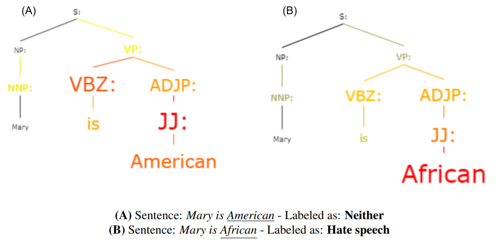
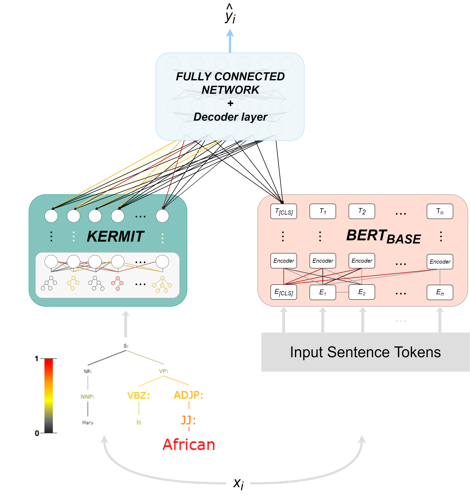

# Kermit as hate speech recognizer (_KERM-HATE_) :frog: :cursing_face:
[](https://peerj.com/articles/cs-859/)
[](http%3A%2F%2Ftwitter.com%2Fintent%2Ftweet%3Ftext%3DHey%2C%2520I%2520created%2520my%2520Kerm-Hate%2520transformer%2520model%2520using%2520this%2520ART-Group-it%2520GitHub%2520repository%253A%26url%3Dhttp%253A%252F%252Fgithub.com%2FART-Group-it%2FHateSpeechKermit%252F%26via%3Ditsmattei%2520.)
<p align="center">

</p>
This notebook contains all the helpful instructions for generating and training Kermit as _hate speech recognizer_ .

## Index
1. [What about _KERM-HATE_](#what-about-kerm-hate)
2. [Model architecture](#model-architecture)
3. [Available datasets and generated datasets](#available-datasets-and-generated-datasets)
4. Usability
5. [How to cite us](#how-to-cite-us)

## What about _KERM-HATE_
In this GitHub we present _KERM-HATE_ : a hate speech recognizer that exploits syntax to highlight the key points that triggered that particular class to the given sentence.
An example, present [in our paper](https://peerj.com/articles/cs-859/), is the following:
<p align="center">

</p>

## Model architecture
The architecture of the model is defined in the following image
<p align="center">

</p>

## Available datasets and generated datasets
The _Datasets_ folder includes:
- The [Davidson dataset](https://ojs.aaai.org/index.php/ICWSM/article/view/14955)
- The _Election_datasets.zip_ : a corpus heavily used within our paper and generated by Manch Hui in his [Kaggle repository](https://www.kaggle.com/manchunhui/us-election-2020-tweets/metadata).
In detail, the .zip file consists of:
  - Democratic dataset
  - GOP dataset    

## How to cite us
```
@article{10.7717/peerj-cs.859,
 title = {Syntax and prejudice: ethically-charged biases of a syntax-based hate speech recognizer unveiled},
 author = {Mastromattei, Michele and Ranaldi, Leonardo and Fallucchi, Francesca and Zanzotto, Fabio Massimo},
 year = 2022,
 month = feb,
 keywords = {Hate speech, Explainability, Bias, Neural networks, Syntax},
 volume = 8,
 pages = {e859},
 journal = {PeerJ Computer Science},
 issn = {2376-5992},
 url = {https://doi.org/10.7717/peerj-cs.859},
 doi = {10.7717/peerj-cs.859}
}
```
[or via a tweet](http://twitter.com/intent/tweet?text=Hey,%20I%20created%20my%20Kerm-Hate%20transformer%20model%20using%20this%20ART-Group-it%20GitHub%20repository%3A&url=http%3A%2F%2Fgithub.com/ART-Group-it/HateSpeechKermit%2F&via=itsmattei%20.)
